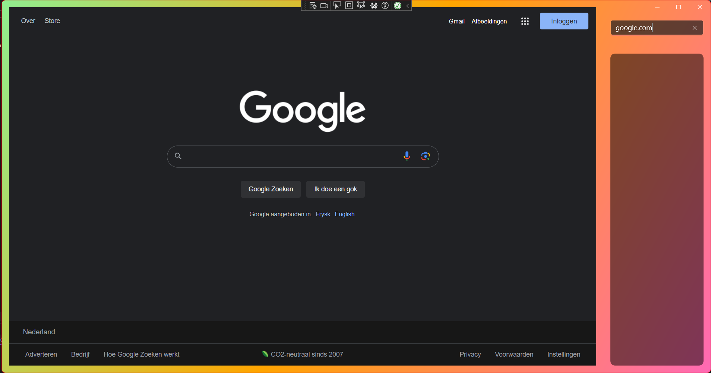

# Narc - The Knock-off Arc (For windows)

Hi there, because it's summer vacation. I decided to work on some proejcts because I was bored. One of these projects is a simple Web-browser inspired by [The Browser Company](https://thebrowser.company/).

  

___

It's build in C#. So don't expect anything to fancy... It was just ment as a fun side project. I also personally don't own a MacOS device, so I don't expect that most functionalities work the same... But then again, it wasn't ment to (exactly anyway).

I at least enjoyed the build and refreshed my C#. Eventho I didn't do it in Swift or C++, it was still fun.

___

So I currently don't have plans to put an executable program online. But to get started, I would highly recommend checking [This Tutorial](https://learn.microsoft.com/en-us/windows/apps/winui/winui3/create-your-first-winui3-app). It's about setting up the Visual Studio environment, and from there you can you implement the code.

